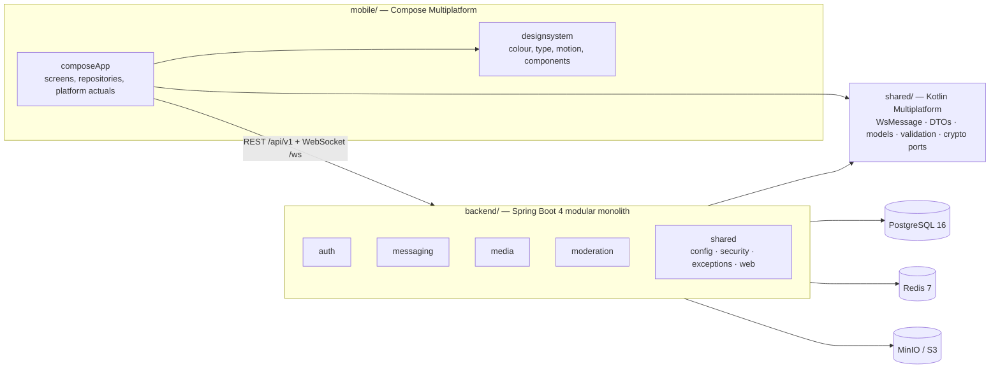
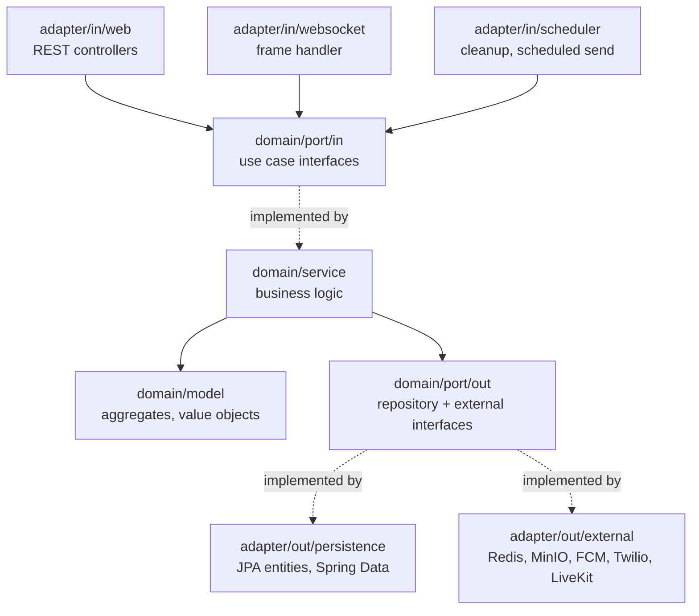
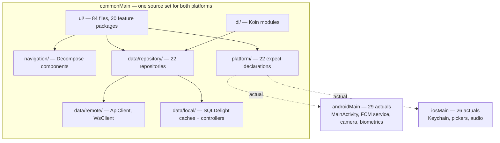
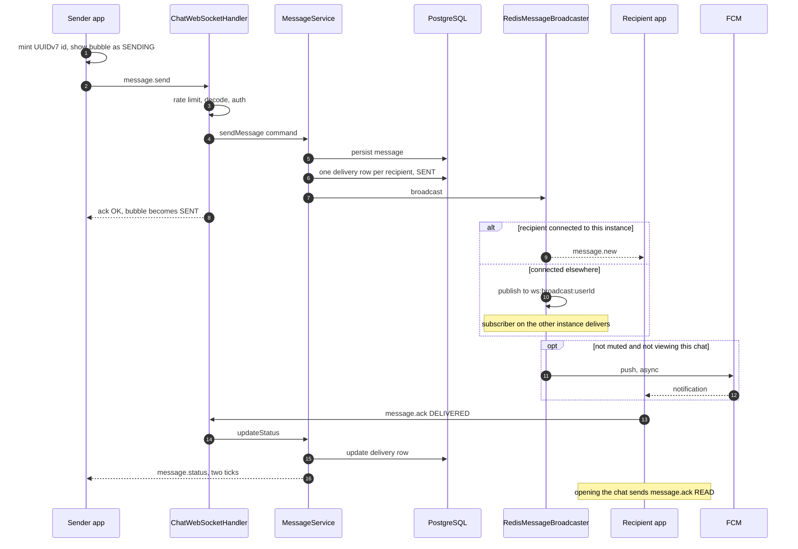

# Muhabbet — architecture

What shape this system is, and why it has that shape.

This is written for a person: a new engineer, or the owner six months from now. It describes
boundaries and flows, not code — where the exact text matters, the file is named so you can go read
it. Everything here was checked against the source on **2026-08-21**; where a claim could not be
verified it says so rather than guessing.

`CLAUDE.md` is not this document. It is 77 KB of operating instructions for agents — every line a
lesson some session paid for — and it is indispensable for *working* here and useless for
*understanding* the system. Read this first, then that.

---

## 1. The shape in one paragraph

Muhabbet is a **modular monolith**: one Spring Boot process, split internally into modules that each
apply **Ports & Adapters** (hexagonal architecture). Beside it sits a **Kotlin Multiplatform module**
that is compiled into *both* the server and the mobile app, so the wire protocol and the DTOs have
exactly one definition and cannot drift. The client is a **Compose Multiplatform** app targeting
Android and iOS from one source set. Everything is Kotlin.



Two things in that picture do the most work.

**The `shared/` module is the contract, not a utility library.** The WebSocket protocol is a sealed
Kotlin hierarchy that both sides compile against. A new message type that the server can emit and the
client cannot parse is a compile error, not a production incident.

**The backend's module boundaries are real but cheap.** They are package boundaries plus a rule about
dependency direction — not services, not deployments. That is a deliberate trade, made once and
recorded in [ADR-001](adr/001-modular-monolith.md): a single engineer moves several times faster in
one process, and the seams are drawn where a service would be extracted if that ever becomes worth
doing.

---

## 2. The backend

`backend/src/main/kotlin/com/muhabbet/` — 337 Kotlin files in **five** top-level packages.

| Package | Size | What it owns |
|---|---|---|
| `auth` | 74 files | Phone OTP, JWT issue/refresh, devices, two-step, user profile and privacy settings, contact sync via phone hashes, companion-device linking |
| `messaging` | 215 files | Everything a conversation is: messages, delivery status, groups, communities, channels, statuses, polls, reactions, search, backups, bots — **plus presence and push** |
| `media` | 14 files | Upload, download, thumbnails, presigned URLs, storage accounting |
| `moderation` | 10 files | Reports and blocks (BTK Law 5651), admin review |
| `shared` | 23 files | Cross-cutting: `config/`, `security/`, `exception/`, `web/`, `analytics/`. **Not hexagonal** — it is framework wiring by definition |

> **`presence` and `notification` are not modules.** Older documents list them as peers of `auth` and
> `messaging`; no such packages exist. Presence is `messaging/adapter/out/external/RedisPresenceAdapter.kt`
> behind `messaging/domain/port/out/PresencePort.kt`, and push is the `FcmPushNotificationAdapter` /
> `NoOpPushNotificationAdapter` / `OfflinePushSender` trio in the same folder. They are adapters of
> `messaging`, which is correct — both exist only to serve a message.

`messaging` is two-thirds of the backend and is the module most likely to need splitting one day. The
seam is already visible: conversations, group administration, channels and status/stories barely
touch each other's models.

### The hexagon

Every module except `shared` has the same interior:



**Every arrow points inward, and the centre knows nothing.** That is the whole rule; the folder names
exist to make a violation visible in a diff. Three consequences are worth stating because they are
what people get wrong:

- **A JPA entity is not a domain model.** `MessageJpaEntity` and `Message` are different types with a
  mapper between them. This looks like duplication and is the price of the domain not importing
  Hibernate.
- **Controllers depend on use-case interfaces**, never on a service class and never on a Spring Data
  repository. A controller validates, calls one interface, and maps the result.
- **The domain has no Spring annotations at all.** Services are plain classes, wired by hand in
  `shared/config/AppConfig.kt` — 33 `@Bean` methods whose only job is to keep `@Service` out of the
  domain layer.

The rules are enforced by ArchUnit tests in the backend suite, not by good intentions.

### Cross-cutting `shared/`

| Package | Contents |
|---|---|
| `config/` | `AppConfig` (domain wiring), `RedisConfig` (incl. the pub/sub subscriber), `WebSocketConfig`, `AsyncConfig`, `FirebaseConfig`, `JsonConfig`, and the `@ConfigurationProperties` holders |
| `security/` | `SecurityConfig`, `JwtProvider`, `JwtAuthFilter`, `AuthenticatedUser`, `RateLimitFilter`, `WebSocketRateLimiter`, `InputSanitizer`, `SsrfGuard` |
| `exception/` | `ErrorCode` — a single enum with **92** entries, each carrying an HTTP status and a default message — and `BusinessException`, `GlobalExceptionHandler` |
| `web/` | `ApiResponseBuilder` — the only place the response envelope is constructed |

`ErrorCode` is the reason there are no inline error strings anywhere in the backend: the enum name is
the contract the client switches on, and the message is a fallback for humans.

### What the outside world sees

- **REST:** everything under `/api/v1`. No servlet context path — the prefix is in each
  `@RequestMapping`.
- **WebSocket:** a single endpoint, `/ws`.
- **Envelope:** every REST response is `ApiResponse<T>`, defined in the shared module:

  ```kotlin
  data class ApiResponse<T>(val data: T? = null, val error: ApiError? = null, val timestamp: String)
  data class ApiError(val code: String, val message: String)
  ```

  One shape for success and failure, so the client has one decode path. Note the sharp edge: the
  builder's `noContent()` returns **HTTP 200 with `data = null`**, not 204 — so "no content" and "a
  server error the client did not check for" look identical on the wire. That is the mechanism behind
  a whole class of past bugs and is why the client must check the status code, not just the body.
- **Auth is carried differently on the two channels.** REST uses `Authorization: Bearer`, checked by
  `JwtAuthFilter`. The WebSocket takes the JWT as a **query parameter** — `wss://host/ws?token=…` —
  because browsers cannot set headers on a WebSocket handshake. `/ws/**` is therefore `permitAll` in
  `SecurityConfig` and `ChatWebSocketHandler` does its own authentication, closing with
  `POLICY_VIOLATION` on a missing or invalid token.

The full endpoint and frame catalogue is [`api-contract.md`](api-contract.md).

---

## 3. The shared module — one definition, two consumers

`shared/` is a Kotlin Multiplatform library with targets `jvm`, `androidTarget`, `iosArm64` and
`iosSimulatorArm64`. In practice it is **100 % `commonMain`** — nine files, no platform-specific
source at all, which is exactly what you want from a contract.

| Package | What it defines |
|---|---|
| `protocol/` | `WsMessage` — the sealed hierarchy that *is* the WebSocket protocol, plus its configured `Json` |
| `dto/` | Every REST request and response, headed by the `ApiResponse` envelope |
| `model/` | The models both sides genuinely share: `Message`, `ContentType`, `MessageStatus`, `PresenceStatus`, `CallType` |
| `validation/` | Rules that must agree on both sides — message length, the edit window, the reaction allow-list, PIN rules |
| `port/` | Crypto seams: `EncryptionPort`, `E2EKeyManager`, `E2EEnvelope`, `MediaKeyMaterial`, `DeviceLinkCrypto` |

`backend/build.gradle.kts` and `mobile/composeApp/build.gradle.kts` both declare
`implementation(project(":shared"))`. That is the whole mechanism.

**The wire type discriminators are `@SerialName` values, not class names** — `message.send`,
`message.new`, `message.ack`, `message.status`, `ack`, `presence.typing`, `error`. Any client written
outside this repository must use those exact strings.

### Why the backend keeps its own enums

`ContentType`, `ConversationType` and `MemberRole` exist in *both* the backend domain and the shared
module, with mappers between them. This is deliberate, and it is the one place the project accepts
duplication on purpose: the backend domain must not import a serialization-annotated type, because
then the domain's shape would be governed by what the wire needs. The mappers are the tax on that
rule. If the tax ever exceeds the benefit, the fix is type aliases, not deleting the boundary.

### The crypto seam is a seam, and it is currently a no-op

`EncryptionPort` and `E2EKeyManager` have real implementations only on the disabled path.
`NoOpEncryption` and `NoOpKeyManager` are what is bound in production on **both** platforms.
`NotYetImplementedDeviceLinkCrypto` *throws* on every method rather than returning something
plausible — a deliberate choice, so that multi-device linking cannot quietly ship home-grown crypto.
See §7.

---

## 4. The mobile app

Two Gradle modules: `:mobile:composeApp` (167 files in `commonMain`) and `:mobile:designsystem`
(23 files). The dependency is one-way and compiler-enforced: **the design system cannot see the
app.** It also holds no user-visible strings and keeps its raw colours `internal`, so no screen can
name a hex value. The single entry point is `com.muhabbet.designsystem.Muhabbet`.



Four things about this layout are not what the framework's defaults would give you, and each is a
decision:

**There are no ViewModels.** Not one — `ViewModel` appears nowhere in the app's source. Screens hold
their own state in `remember { mutableStateOf(...) }` and pull dependencies with `koinInject()`.
State that genuinely spans screens lives in a small number of Koin **singletons** exposing a
`StateFlow`: `ThemeController`, `PrivacySettingsController`, `AppLockController`, and `WsClient`'s
connection state and inbound flow. This is KISS applied deliberately, and it has one hard rule
attached: **a value that two screens show must come from one of those singletons.** Two screens each
holding their own `remember` copy of the same setting is how the app once displayed two read-receipt
switches that disagreed with each other.

**Navigation is Decompose, and animation is quarantined.** `RootComponent` holds a two-state stack —
authenticated or not — and `MainComponent` holds the real one, a 30-entry sealed `Config`. Screen
transitions may only be built in `navigation/MuhabbetStackAnimations.kt`; a guardrail check fails the
build if a `StackAnimation` is constructed anywhere else. The physics comes from the design system,
the plumbing stays in the app, because a design library must not know what navigation is.

**The local database is a cache and an outbox, not a source of truth.** SQLDelight holds
`CachedConversation`, `CachedMessage` and `PendingMessage`. Repositories read cache-first and
write through on success. Critically, **a message sent while the socket is up never touches the
database** — the optimistic bubble is in-memory Compose state. The database is written only when the
socket is *down*, and if that write fails the send throws a *different* exception, so a message that
was never stored cannot be shown to the user with a "queued" clock over it.

**`platform/` is the only place `expect`/`actual` lives.** 22 declarations — camera, audio record and
play, contacts, push tokens, biometrics, speech, background sync. A screen never knows which platform
it is on.

The visual language, its palette rationale and its guardrail baselines are a separate document:
[`design/muhabbet-design-system.md`](design/muhabbet-design-system.md).

---

## 5. How a message actually travels

This is the path worth knowing in full, because almost every subsystem touches it.



Details that matter and are easy to get wrong:

- **Idempotency is the client's `messageId`.** The client mints a UUIDv7 and the server treats a
  repeat as the same message. This is what makes the offline queue safe to drain more than once.
- **The single tick is a server ack, not delivery.** `SENT` means the server stored it. `DELIVERED`
  and `READ` require the *other* device to send `message.ack` back — so if the recipient's app is
  closed and its push path is not working, the sender sits on one tick forever. That is not a bug in
  the sender.
- **Blocking drops the message after validation and before insert.** The sender still receives
  `ack OK`. This is intentional: telling a blocked sender they were blocked is itself information.
- **A block hides presence both ways, and a message only one way.** The asymmetry is deliberate and
  worth stating because it looks like an inconsistency. Presence — the online dot, last seen, about,
  and the typing indicator — is withheld in *both* directions whichever of the two pressed Block;
  `messaging/domain/service/PresenceVisibility` is the only place that rule is written, and every
  surface that shows any of it asks that. Sending a message, adding someone to a group and adding
  someone to a community stay one-directional: only the *recipient's* block counts, because someone
  who messages a person they themselves blocked is not a victim and swallowing their outgoing
  message reads as a fault. Those four call sites each carry a comment saying so.
- **Two broadcasters exist and only one is live.** `RedisMessageBroadcaster` is `@Primary` and is what
  runs. The other, in `adapter/out/NoOpMessageBroadcaster.kt`, declares a class called
  `WebSocketMessageBroadcaster` — the filename has not matched its contents for some time — and is
  registered but never injected. Do not add behaviour to it.
- **Push is asynchronous and is no longer gated on being offline.** It fires unless the recipient
  muted the conversation or is currently looking at it, and it runs on a dedicated executor
  (`AsyncConfig.PUSH_EXECUTOR`) so a slow FCM call cannot stall the broadcast loop. The class is
  still named `OfflinePushSender`; the name is stale, the behaviour is intended.
- **Read receipts are downgraded at publish time, not at storage time.** If the reader has receipts
  switched off, the stored row is `READ` — so their own unread badge clears — while what is published
  to the sender is `DELIVERED`. One column serves both concerns, and doing it the other way round
  would have broken the reader's own state.
- **Delivery status the sender sees is an aggregate**: all recipients `READ` → `READ`; any of them
  `DELIVERED` or better → `DELIVERED`; otherwise `SENT`. A recipient sees only their own row.

---

## 6. State, storage and the outside world

| Store | What lives there | Notes |
|---|---|---|
| **PostgreSQL 16** | Everything durable — users, devices, conversations, messages, delivery status, media metadata, moderation, communities, backups | One database. 22 Flyway migrations, `V1`…`V22`, contiguous. UUID primary keys. Soft delete via `deleted_at` where KVKK erasure requires it |
| **Redis 7** | Presence (TTL keys), typing, session cache, and the `ws:broadcast:*` pub/sub channel | Losing Redis loses presence and cross-instance fan-out, not messages. **The integration tests need it running**, not just Postgres |
| **MinIO (S3 API)** | Media blobs | Presigned URLs are generated against the *internal* endpoint and then string-replaced to the public one, because the SDK makes internal calls that cannot traverse the proxy |
| **SQLDelight (device)** | Conversation and message cache, pending-message outbox | Cache and outbox only — see §4 |

**External services:** Twilio Verify for OTP in production (Netgsm and a mock sender are also
implemented behind the same port), FCM for push, LiveKit for call rooms (unconfigured — see §7).
Every one of them sits behind a port in `domain/port/out/`, which is what made swapping the SMS
provider a configuration change rather than a rewrite.

**Schema changes are Flyway migrations, always.** Never alter the database by hand, and never edit a
migration that has been applied in production — add a new one. `validate-on-migrate: false` belongs
only in the dev and test profiles; it once leaked into the main config, which meant production
silently accepted edited migrations.

---

## 7. What has deliberately *not* been built

A description of a system that lists only what exists is a sales document. These are the load-bearing
absences, each verified against the code.

**End-to-end encryption is off, and it is off twice over.** `E2EConfig.ENABLED` and
`E2EConfig.MEDIA_ENABLED` are both `false`, so messages travel as plaintext under TLS and the server
can read them. Even flipping those flags would encrypt nothing, because `NoOpKeyManager` and
`NoOpEncryption` are what the DI binds on Android *and* iOS. The Signal implementation exists as four
`*.kt.disabled` files, and the libsignal dependency itself is **commented out** of the Gradle build —
the app does not link libsignal at all. Re-enabling this is a crypto-correctness rewrite that needs a
real device, a two-device round trip and a review; it is the gate on 1.0.0, and it is not something
to attempt as a version bump. The UI is honest about it: there is no padlock while this is the state.

**Voice and video calls do not connect.** The protocol types, `CallSignalingService`, the
`call_history` table and a LiveKit room adapter all exist. The mobile client **never sends
`call.initiate`** — there is not one reference to it anywhere under `mobile/` — and
`LIVEKIT_ENABLED` defaults to `false`, so the NoOp room provider is the live bean in production.
This is a vertical slice built from both ends that has never met in the middle.

**It runs as a single instance, on purpose.** `docker-compose.prod.yml` fixes the container name and
declares no replicas, which forbids scaling by construction. The cross-instance fan-out is
nonetheless fully wired — publisher *and* subscriber — so the day a second instance is wanted, that
part is real. Two things are not multi-instance-correct yet and would need doing first: WebSocket
rate limiting is an in-process `ConcurrentHashMap`, not Redis-backed, and push suppression consults
only the local session registry.

**iOS is a target, not a product.** The Compose Multiplatform iOS target builds and 26 platform
actuals are implemented, but `iosMain` has no application entry point and no UI host, LiveKit and
Signal are stubs, and nothing has been through TestFlight.

**Multi-device linking is half-built and says so.** The non-crypto half — QR handshake, companion
registry, a four-device cap, revocation — is behind a default-off flag. The crypto half throws.

**There is no message broker, no service mesh and no Kubernetes.** This was assessed explicitly and
declined: one host, one engineer, YAGNI. `docs/findings/2026-06-19-infra-tech-assessment.md` has the
reasoning.

---

## 8. Where the seams are

If this system has to change shape, these are the places designed to give:

- **A module becomes a service** by promoting its `domain/port/out` interfaces to network calls. The
  candidate is `messaging`, and the internal fault line runs between conversations, channels and
  status.
- **A store gets swapped** behind its port. `MessageRepository` is an interface; PostgreSQL is one
  implementation of it.
- **A provider gets swapped** behind its port — this already happened with SMS, from mock to Netgsm
  to Twilio Verify, without touching a service.
- **Encryption gets turned on** behind `EncryptionPort`. The seam is real; the implementation is not.
- **A second instance appears** behind the Redis broadcaster, once rate limiting and push suppression
  move out of process.

The consistent principle: **the domain owns the interface, the infrastructure implements it, and the
direction never reverses.** Most of what looks like ceremony in the folder layout is there to make a
reversal visible the moment someone tries it.

---

## Related documents

| Document | What it is |
|---|---|
| [`api-contract.md`](api-contract.md) | The REST and WebSocket surface, endpoint by endpoint |
| [`adr/`](adr/) | Architecture Decision Records — why one way and not another |
| [`decisions.md`](decisions.md) | The original decision table from project start. Historical; several entries have been overtaken |
| [`design/muhabbet-design-system.md`](design/muhabbet-design-system.md) | The visual language and its guardrails |
| [`e2e-rollout-runbook.md`](e2e-rollout-runbook.md) | What would have to be true before the E2E flags move |
| [`../ROADMAP.md`](../ROADMAP.md) | What ships in which version, and how that is decided |
| [`../CLAUDE.md`](../CLAUDE.md) | Operating instructions and accumulated gotchas |
