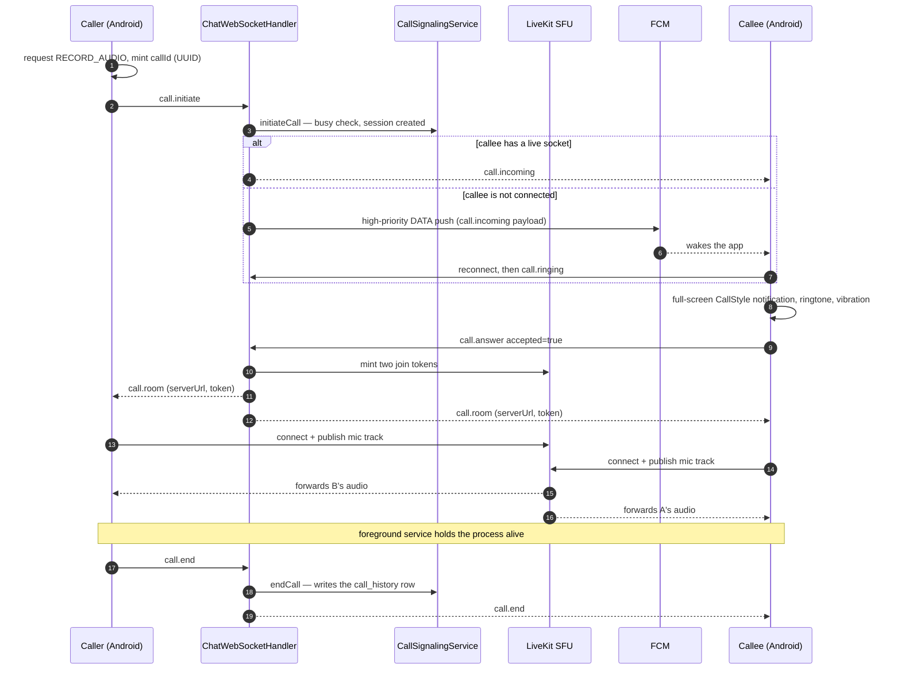

# Design: Voice and video calls

| | |
|---|---|
| **Status** | Design. Not started. Nothing described below has been built. |
| **Author** | Engineering, 2026-08-21 |
| **Reviewers** | (owner) |
| **Milestone** | [`0.7.0 — Live`](https://github.com/ahmetabdullahgultekin/Muhabbet/milestone/7) — *"a call connects, carries audio both ways, and appears in history"* |
| **Feature flag** | `muhabbet.livekit.enabled` (backend, exists, default OFF) + `CallsConfig.ENABLED` (mobile, **to be added**) |
| **ADR** | [ADR-0009 — where call media runs](../adr/0009-call-media-infrastructure.md) |
| **Issues** | #367 #368 #369 #370 #371 #372 #373 #606; #84 and #86 for the later stages |

> **Every claim here was checked against the source on 2026-08-21**, on `origin/dev` at `296ef51`,
> and against the running production host. Where something could not be verified it says so. Line
> numbers are given so the next person does not have to rediscover any of it.

---

## 1. Where this actually stands

Calling has never worked in this app, and the reason is not a bug. A vertical slice was built from
both ends and the two ends were never joined. The protocol exists. The backend handler exists. Three
screens exist. The table exists. A LiveKit adapter exists. **No call has ever been placed**, and
`call_history` holds **0 rows** against 9 registered users in production (`select count(*) from
call_history` on `shared-postgres`, 2026-08-21).

The app is currently honest about it, which is recent and worth knowing before reading the rest: the
Calls tab, the profile call button and the new-call contact picker all show *"Arama özelliği
yakında"* rather than minting a fake call id and pushing a screen (`CallHistoryScreen.kt:96-106`,
`UserProfileScreen.kt:93`, `NewConversationScreen.kt:115`). The starting position is not "broken
calling". It is "no calling, admitted".

### What exists and what is missing

| Piece | State | Evidence |
|---|---|---|
| Wire protocol — `call.initiate`, `call.answer`, `call.ice`, `call.end`, `call.incoming`, `call.room` | **Exists**, in the shared module, so both sides compile against it | `shared/.../protocol/WsMessage.kt:88-140` |
| `call.group_start` | **Exists**; produced and consumed by nothing | `WsMessage.kt:333-340` |
| Backend frame dispatch for all four inbound call frames | **Exists** | `ChatWebSocketHandler.kt:124-127` |
| `CallSignalingService` — session state, one-call-per-user, history persistence | **Exists**, 227 lines, 293 lines of unit tests, wired at `AppConfig.kt:272-277` | `messaging/domain/service/CallSignalingService.kt` |
| …but its state is an **in-process `ConcurrentHashMap`** | A backend restart forgets every call in flight, and a second instance would not see them at all | `CallSignalingService.kt:24,27` |
| `CallRoomProvider` port, LiveKit adapter, NoOp fallback | **Exists** | `domain/port/out/CallRoomProvider.kt`; `adapter/out/external/LiveKitRoomAdapter.kt:25,87` |
| `CallHistoryService` + `GET /api/v1/calls/history` | **Exists** and works. It returns an empty page | `adapter/in/web/CallHistoryController.kt:17,23` |
| `call_history` table | **Exists** | `V12__add_call_history.sql`, extended by `V16__whatsapp_feature_parity.sql:150-152` |
| `group_call_participants` table | **Exists**, 0 rows, no reachable writer | `V16__whatsapp_feature_parity.sql:142-148` |
| `IncomingCallScreen`, `ActiveCallScreen`, `CallHistoryScreen` | **Exist** — 755 lines between them | `mobile/.../ui/call/` |
| `CallEngine` expect/actual; LiveKit Android SDK 2.28.0 is a real dependency | **Exists**, and connects to a room | `platform/CallEngine.android.kt:21-30`; `mobile/composeApp/build.gradle.kts:115` |
| **Client sending `call.initiate`** | **Missing.** Zero references anywhere under `mobile/`. The client can send seven frame types and this is not one of them | `grep -rn CallInitiate mobile/` returns nothing |
| **Client handling `call.incoming`** | **Missing.** The app's only global WS collector handles `NewMessage` and nothing else; `openIncomingCall` has no callers | `App.kt:142-143`; `MainComponent.kt:207` |
| **Publishing a microphone track** | **Missing.** `setMicrophoneEnabled` and `publishAudioTrack` appear nowhere. `setMuted` hunts for a `LocalAudioTrack` that is never created; `setSpeaker` is an empty block | `CallEngine.android.kt:39-45,47-56` |
| **LiveKit configured in production** | **Missing.** `docker exec muhabbet-backend env \| grep -c LIVEKIT` → `0`. `NoOpCallRoomProvider` is the live bean and returns `serverUrl = ""` | `application.yml:182-186`; `LiveKitRoomAdapter.kt:86-93` |
| **…so `call.room` is never sent even for a correctly signalled call** | The room-info block sits inside `if (room.serverUrl.isNotBlank())` with **no else branch**. Both parties get the answer forwarded, no media credentials, and no error | `ChatWebSocketHandler.kt:363` |
| **A ring timeout** | **Missing.** `ActiveCallScreen` waits for `call.room` forever | `ActiveCallScreen.kt:116-142` |
| **RECORD_AUDIO / CAMERA requested for a call** | **Missing.** Both are declared; the only runtime requester belongs to voice messages | `AndroidManifest.xml:8-9`; `ChatScreen.kt:259` |
| **A foreground service** | **Missing.** `grep -rn "startForeground\|ForegroundService" mobile/` returns nothing and the manifest declares no call service | `AndroidManifest.xml` |
| **A push path for calls** | **Missing.** `PushNotificationPort.sendPush` has exactly one caller, on the message path | `OfflinePushSender.kt:98` |
| **A high-priority data push** | **Missing.** The FCM adapter always attaches a `notification` block and never sets a priority — `grep -rn setPriority backend/src` returns nothing | `FcmPushNotificationAdapter.kt:43-67` |
| **Offline-callee handling** | The backend ends the call `MISSED` the instant `isOnline(calleeId)` is false, and nothing keeps a backgrounded phone's socket alive | `ChatWebSocketHandler.kt:314-320`; `WebSocketSessionManager.kt:147` |
| **iOS media** | `connect()` sets a boolean and reports success. No CallKit, no PushKit | `CallEngine.ios.kt:14-17` |
| **Any video path at all** | **Missing.** No `LocalVideoTrack`, no camera capture, no renderer surface anywhere in the app. `CallType.VIDEO` selects a label and an icon | `ActiveCallScreen.kt:96`; `IncomingCallScreen.kt:179` |
| Group calls | `initiateGroupCall` / `joinGroupCall` / `leaveGroupCall` have no callers; `GroupCallParticipantRepository` has no consumer outside its own adapter | `CallSignalingService.kt:114,141,158` |
| API contract documentation | **Missing.** `docs/api-contract.md` documents no call endpoint and no call frame | — |

### Three corrections to the issues as filed

They were written on 2026-08-15 and the ground has moved under two of them.

- **#370 says "FCM is off in prod anyway."** It is on now: `docker exec muhabbet-backend env | grep
  FCM_ENABLED` → `FCM_ENABLED=true`. The push *transport* is live. There is still no call *push*.
- **#367 says the three call entry points mint a fake call id.** Those entry points are gone; the
  surfaces say "coming soon". `openActiveCall` and `openIncomingCall` survive deliberately as the
  destinations for the wiring this document plans — `MainComponent.kt:203-222` records that intent
  in place.
- **#372 is half-addressed.** The accept and decline sends now use `runCatchingCancellable`, which
  **rethrows** `CancellationException` by design (`util/RunCatchingCancellable.kt:34-35`). But the
  scope is still `rememberCoroutineScope()` (`IncomingCallScreen.kt:61`) and `onAccept()` still
  tears down the composition synchronously (`:160-171`). A cancelled answer is now silently dropped
  instead of mislogged. It still needs an app-scoped coroutine.

### The one claim to stop repeating

`docs/PRODUCT_ROADMAP_2026-06-06.md:160` calls the mic-track publish a *"one-line fix"*, and P0-22
calls working calls *"culturally non-negotiable"*. The second is a fair reading of the Turkish
market. The first is wrong, and believing it is how this feature sat on a roadmap for six months
without moving. Publishing a mic track **is** one line, and on its own it is worth nothing: it sits
behind an unconfigured SFU (#369), a client that never signals (#367), a callee that never rings
(#370) and a permission never requested (#372). Each of those is independently fatal. There is no
one-line version of this feature.

---

## 2. Goals and non-goals

**Goals**

- A 1:1 **voice** call between two Android phones against the production backend: it rings, it is
  answered, audio flows both ways, hanging up ends it, and a `call_history` row appears.
- The callee is rung when the app is **backgrounded or closed**, not only when it is open.
- Honest failure. A call that cannot connect says so and stops, rather than counting seconds.

**Non-goals for the first shippable slice**

- **Video.** A later stage, needing the same infrastructure plus a camera lifecycle (§8).
- **iOS.** Needs CallKit, PushKit, a paid Apple Developer account and a separate VoIP certificate,
  none of which this project has (§4).
- **Group calls.** The backend vertical exists and is unreachable; it stays unreachable until 1:1
  works (#373, #86).
- **End-to-end encrypted media.** An SFU sees decrypted media by construction, and this project's
  E2E is off with libsignal removed from the build (§6).
- Call recording, call links, screen share, PSTN bridging.

---

## 3. How a call would work

The architecture is not in question. It is the one the code already half-implements, and it is the
standard one: **signalling over the existing WebSocket, media over an SFU.** Nothing here proposes a
new transport.

An SFU — Selective Forwarding Unit — is a server that receives each participant's encrypted media
stream and forwards it to the others without decoding or re-encoding it. That last part is the whole
reason to prefer it over an MCU: no transcoding means the cost is packet forwarding, not video
compression. The alternative, peer-to-peer, is genuinely cheaper for 1:1 — but it needs a TURN relay
anyway for the significant fraction of users behind symmetric NAT or carrier-grade NAT (which
Turkish mobile networks use heavily), it exposes each participant's IP address to the other, and it
does not extend to group calls at all. The existing code chose an SFU. That choice stands.



Four things in that picture do not exist today and are the real work:

1. **Steps 2 and 3** — the client sending `call.initiate` and the app-wide collector turning
   `call.incoming` into a navigation. Small, and blocked by nothing.
2. **The push branch** — a high-priority *data* message, a full-screen notification, and a route
   from `CallSignalingService` to `PushNotificationPort`. This is §4 and it is the largest single
   piece of client work.
3. **The SFU** — it has to run somewhere. This is §5, it is the decision that gates everything, and
   it is why the milestone says *"do not start the client work before that is settled."*
4. **Publishing the mic track and holding the process alive** — one line and one foreground service.

### Two backend changes the current design needs

**Call state must survive a restart, or the restart must end calls cleanly.** `CallSignalingService`
holds sessions in two `ConcurrentHashMap`s (`:24,27`). A deploy during a call leaves the phones
connected to the SFU with the backend believing no call exists — no `call.end` is ever forwarded,
and no history row is ever written. The cheap correct answer for one instance is to write the
`INITIATED` row at initiate time rather than at end time, and to reconcile orphans on startup. The
expensive answer is Redis-backed session state, which is only worth doing when there is a second
instance (`ARCHITECTURE.md` §7).

**The `serverUrl.isNotBlank()` guard must fail loudly.** `ChatWebSocketHandler.kt:363` has no else
branch, so a misconfigured SFU produces an answered call with no media and no error. It should end
the call with a reason the client can show.

---

## 4. Where the media runs, and what it costs

The SFU has to run somewhere, and this is the decision the 0.7.0 milestone says must be settled
before any client work starts. It is recorded separately as
[ADR-0009](../adr/0009-call-media-infrastructure.md); this section is the arithmetic behind it.

### What LiveKit actually needs

From LiveKit's own documentation, read 2026-08-21:

| | |
|---|---|
| **Ports** | TCP **7880** (API + WebSocket, "should be placed behind a load balancer that can terminate SSL"), TCP **7881** (media over TCP, "used when the client could not connect via UDP"), UDP **50000–60000** for media — *two ports per participant* — or, alternatively, **all media muxed onto a single UDP port, 7882**, in which case the range is not used ([ports & firewall](https://docs.livekit.io/home/self-hosting/ports-firewall/)) |
| **TURN** | **Built in — a separate TURN server is not required.** The embedded TURN listens on UDP **3478** (which also serves as STUN) and TURN/TLS **5349**. Two conditions: without a load balancer the TLS port "needs to be set to **443**, as that will be the port that's advertised to clients", and it needs **its own domain and a CA-signed certificate** — "self-signed certs do not work here" ([deployment](https://docs.livekit.io/home/self-hosting/deployment/)) |
| **Redis** | Not required for a single node. Configuring it is what *switches* LiveKit into distributed mode ([distributed](https://docs.livekit.io/home/self-hosting/distributed/)) |
| **Sizing** | **LiveKit publishes no CPU or RAM recommendation.** What it says is that scalability "is bound by CPU and bandwidth", that production should run on "10Gbps ethernet or faster", and that compute-optimised instance types are most suitable. Every per-core number below is *derived* from the benchmarks, not quoted |
| **Room affinity** | "Each room must fit within a single node" ([benchmark](https://docs.livekit.io/home/self-hosting/benchmark/)) — irrelevant for 1:1, a constraint for large group calls |

**Published capacity**, on a 16-core compute-optimised GCP instance (`c2-standard-16`), same page:

| Scenario | Participants | CPU at peak | Outbound |
|---|---|---|---|
| Large audio room | 3,010 (10 publishing, 3,000 subscribing) | 80 % | 23 MB/s |
| Large video meeting, 720p | 300 (150 publishing, 150 subscribing) | 85 % | 93 MB/s |
| Livestream | 3,001 (1 publishing) | 92 % | 531 MB/s |

**Do not derive a voice bitrate from the audio row.** LiveKit states on the same page that the audio
benchmark "uses an average audio bitrate of 3kbps" — that is the load generator sending near-empty
packets, not what a phone call sounds like. The citable figure is LiveKit's own client default:
`AudioPresets.music` at **48 kbps**, which is what the SDK publishes out of the box, with `speech`
at 24 kbps and `telephone` at 12 kbps available
([`options.ts`](https://github.com/livekit/client-sdk-js/blob/main/src/room/track/options.ts)).
Video presets from the same file: `h180` = 160 kbps, `h360` = 450 kbps, `h720` = **1.7 Mbps at 30 fps**,
and `h720` is the default capture resolution.

**So, per five-minute 1:1 call, counting the server's *outbound* traffic — the half that everyone
bills for:**

| | Egress per 5-minute call | Ratio to voice |
|---|---|---|
| Voice, 48 kbps default | **≈ 3.6 MB** | 1× |
| Video, `h360` | ≈ 34 MB | ≈ 9× |
| Video, `h720` default | ≈ 128 MB | ≈ 35× |

**The only usable CPU datapoint for calls is the video row**, because the audio row's 3 kbps makes it
meaningless for sizing. 150 publishers plus 150 subscribers of 720p at 85 % of 16 cores implies
roughly **75 concurrent 1:1 video calls on 16 cores** — call it **four to five 1:1 video calls per
core**, and halve that for headroom. Voice is cheaper than video on every axis, so a box sized for
video is more than sized for voice. Anyone quoting a tighter number than this is inventing it.

### The scale this project is actually at

**Nine registered users.** `select count(*) from users` on production, 2026-08-21. That number is the
most important input to this decision and it is the one most likely to be left out of the
conversation.

Two scenarios, both deliberately generous:

| | Pilot: 9 users, 100 calls/month, 5 min each | Growth: 1,000 users, 20 min each per month |
|---|---|---|
| Participant-minutes | 1,000 | 20,000 |
| Voice egress from the SFU | **~0.4 GB/month** | **~7 GB/month** |
| Video `h360` egress, if every call were video | ~3.4 GB/month | ~68 GB/month |
| Video `h720` egress, if every call were video | ~13 GB/month | ~255 GB/month |
| Peak concurrency this implies | one or two calls | tens, not hundreds |

At the pilot figure, **voice calling costs essentially nothing in either compute or bandwidth**. The
production host currently moves about **5.6 GB per day** in total across all five projects
(`/sys/class/net/eth0/statistics`, 761 GB over 136 days of uptime) — so voice calling for the entire
user base would be lost in the noise of what the box already does. Even the growth scenario's 7 GB a
month is under two days of the host's existing traffic.

**This is the finding that should drive the decision: the cost is not the money, and it is not the
bandwidth. It is the operational surface and where the audio is decrypted.**

### Option A — self-host on the existing production host

**Cost: €0. Verdict: no**, and not for any reason to do with the SFU's own appetite.

- **There is no headroom.** Over a five-minute observation window on 2026-08-21 the one-minute load
  average moved between **4.73 and 12.69 on 8 vCPU**, and **3,792 MB of 4,095 MB of swap were in
  use**. One container, `mizan-api`, was alone at 72 % CPU. A box that is swapping is not a box to
  put a real-time media service on.
- **It is also the CI runner**, `muhabbet-cx43`, running one job at a time. A Gradle build and a
  phone call would contend for the same cores. Nobody would connect a stutter to a build.
- **There is no UDP path.** UFW allows `22/tcp`, `80/tcp`, `443/tcp` and `51820/udp` (WireGuard) and
  nothing else. LiveKit needs a media UDP port or range opened, and Traefik — which publishes only
  `80/tcp` and `443/tcp` and fronts every other service on the host — **cannot carry WebRTC media**.
  This would be the first service on the box to need a directly published port.
- **443 is taken.** LiveKit's TURN/TLS fallback wants 443 when there is no load balancer in front of
  it, and Traefik holds it. That fallback is what rescues a client on a network that blocks UDP
  entirely. Co-hosting means giving it up or giving LiveKit its own IP.
- **Disk is at 85 %** (122 GB used of 150 GB, 23 GB free), which is not a blocker for a stateless
  SFU but is one more reason this box should not gain responsibilities.

### Option B — a second small Hetzner box, Germany

**Cost: €8.49–€86 per month** ([current plans](https://costgoat.com/pricing/hetzner), read
2026-08-21).

| Plan | vCPU | RAM | Traffic | €/month |
|---|---|---|---|---|
| CX33 | 4 (shared) | 8 GB | 20 TB | 8.49 |
| CPX32 | 4 (shared) | 8 GB | 20 TB | 35.49 |
| CCX23 | 4 (**dedicated**) | 16 GB | 20 TB | 85.99 |
| CCX33 | 8 (**dedicated**) | 32 GB | 30 TB | 138.49 |

Add **€0.50/month for the IPv4 address**. Hetzner bills **outgoing traffic only** — "incoming and
internal traffic is free" — over a minimum of **20 TB included in EU locations**, at **€1.00 per
additional TB**, metered in 100 MB blocks
([billing FAQ](https://docs.hetzner.com/cloud/billing/faq/)). This project would use single-digit GB.

**A CX33 at €8.49 is several times more capacity than the arithmetic above needs for voice.** The
argument for a dedicated-vCPU CCX plan is jitter, not throughput: a shared vCPU can be de-scheduled
by a noisy neighbour, and in real-time media that is heard rather than measured. That is a real risk
and an unverified one — nobody has run this — so the honest position is: **start on CX33, and treat
a move to CCX23 as a known escape hatch if quality complaints arrive.**

One caution on all of these figures: they come from Hetzner's live price feed and are markedly higher
than Hetzner's own 2023–24 press releases for the equivalent (renamed) plans. This is a real
repricing, not a reading error, but **re-read the feed on the day money is spent.**

What this costs that is not money: a second machine to patch, a TLS certificate to renew, its own
firewall rules, its own monitoring. Nothing to back up — an SFU holds no state.

Latency: Nuremberg to Turkey is in the **35–45 ms** band (`docs/vds-provider-comparison.md` §3), and
media traverses the server, so a round trip is roughly twice that. That is comfortably inside what
people accept on a phone call. It is not as good as Istanbul.

### Option C — LiveKit Cloud

**Cost at this project's scale: $0**, and it stays $0 until roughly five times the pilot's usage
([pricing](https://livekit.com/pricing), read 2026-08-21).

| | Build (free) | Ship | Scale |
|---|---|---|---|
| Plan fee | $0 | from **$50/mo** | from **$500/mo** |
| WebRTC minutes included | 5,000 | 150,000, then $0.0005/min | 1.5 M, then $0.0004/min |
| Downstream data included | 50 GB | 250 GB, then $0.12/GB | 3 TB, then $0.10/GB |
| Concurrent connections | 100 | 1,000 | 5,000 |

The pilot scenario needs 1,000 minutes and 0.4 GB — **entirely inside the free tier**, with no credit
card. The growth scenario needs 20,000 minutes and 7 GB, which is inside Ship's inclusions, so it is
a flat **$50/month** with no per-minute overage at all. There is no separate audio and video rate for
realtime; the split exists only for Egress/Ingress transcoding, which this design does not use.

It is the cheapest option in engineer-hours by a wide margin, and it is the one this document
recommends against — for two reasons that are not about price:

1. **A cloud SFU is a new data processor holding decrypted call audio** (§7). KVKK requires a
   transfer mechanism and a processing agreement per processor, and `docs/legal/README.md` records
   that this has **not** been filed even for Hetzner, FCM or the SMS provider. Adding a fourth
   unpapered processor — the one handling voice — is the wrong direction while three are outstanding.
2. **It contradicts the product's only real claim.** This is a domestic, privacy-first messenger
   whose competitor BiP is telecom-owned. "Your calls go through a US-hosted service" is a sentence
   the project cannot afford, and it would be true.

There is one legitimate use for it: **stage 0, against test accounts only**, to prove the existing
`LiveKitRoomAdapter` token minting works before spending days on server operations. That is a
half-day of de-risking with no real user data involved.

### Option D — a Turkish provider, near Istanbul

The best story, and the hardest numbers to get. **Hetzner has no Turkish location** — the nearest is
Nuremberg or Falkenstein — so this means a different provider, not a different Hetzner region.

The first finding is about the market rather than the price: **most Turkish cloud providers do not
publish one.** Checked 2026-08-21:

| Provider | Public pricing? |
|---|---|
| **Natro** | **Yes.** `XCloud Pro` — 4 vCPU / 8 GB / 200 GB — **list 3.453,09 TL (~$71.99)/month**, promotional 1.438,51 TL for the first three months. `XCloud Large` — 2 vCPU / 6 GB / 100 GB — list 2.062,07 TL (~$42.99). No traffic allowance stated on the page; no datacentre location stated either |
| **Türk Telekom Bulut** | No. "Aylık 450 TL'den başlayan fiyatlarla" on the homepage; every product page is a JavaScript shell with no reachable price |
| **Turkcell Bulut** | No. Per-component monthly pricing with daily billing is *described* in their docs, DCs in Istanbul, Kocaeli and Ankara, but there is no public price table |
| **Radore**, **DGN** | No. One serves a loading shell; the other returned HTTP 521 |
| **Vargonen** | The brand's cloud URL now redirects to an "EclitGO VPS" page — 4 core / 8 GB / 200 GB at $22.98 list. Treat as unidentified |

`docs/vds-provider-comparison.md` (February 2026, **prices not re-checked**) additionally lists
Hostmatik in Istanbul at ~$16.83/month for 6 vCPU / 8 GB DDR5 / 100 GB NVMe, and IHS Telekom in the
Istanbul Vodafone Tier III+ facility from ~$3.45/month.

So the domestic option is roughly **two to four times the Hetzner price for equivalent specification**,
where a price exists at all — which is still under €100/month and still not the deciding factor.

What it buys: latency drops from the **35–45 ms** band to **1–10 ms** (`vds-provider-comparison.md`
§3), and for real-time media that is the one place domestic hosting is measurably better rather than
merely better-sounding. Media traverses the server, so the saving is doubled on the round trip.

What it costs: that same document's verdict on these providers is "unknown reliability" and "almost
zero reputation data", and it is why production ended up in Nuremberg. **An SFU is nonetheless the
ideal first workload to try one with** — it is stateless, holds no database, and if the machine dies
the failure mode is "calls stop" rather than "data is lost". That is a far smaller bet than moving
the backend, and it produces the operational evidence a later decision would need.

### The recommendation

**Self-host, on a small dedicated box that is not the production host.** Prefer Istanbul if a
provider can be verified with a real trial; otherwise a second Hetzner box in Germany, starting at
CX33 (€8.49/month) and escalating to a dedicated-vCPU plan only if quality demands it. Use LiveKit
Cloud's free tier for stage 0 verification against test accounts and for nothing else.

The reasoning, in order of weight:

1. **The money is not the deciding factor** — the gap between every option here is under €100/year
   at this scale, which is less than what the project already spends on SMS.
2. **The SFU decrypts the audio**, so who runs it is a privacy claim, not an implementation detail
   (§7). Self-hosting is the only version in which the answer is "we do".
3. **KVKK paperwork is already behind**, and a cloud SFU makes it worse in the most sensitive
   category.
4. **The existing host cannot take it** — not on CPU headroom, not on swap, not on the firewall, not
   on port 443, and not while it is also the CI runner.
5. **Latency argues for Istanbul**, and an SFU is the safest possible first workload to try a
   Turkish provider with, because losing it loses nothing durable.

The counter-argument deserves to be written down rather than dismissed: **LiveKit Cloud is free at
this scale and costs zero engineer-hours, and this project has one engineer whose scarcest resource
is time, not money.** If the owner weighs shipping speed above the positioning argument, Cloud is a
defensible choice and this document would not call it wrong — it would only insist that the privacy
policy and the `/guvenlik` page say so plainly, and that the processing agreement be filed *before*
the first real call, not after.

---

## 5. Ringing a phone that is not listening

This is the part people underestimate, and it is the reason stage 2 is a stage of its own rather
than a detail of stage 1.

A call is only useful if it reaches someone who is not already using the app. Today the backend ends
the call as `MISSED` the instant `sessionManager.isOnline(calleeId)` returns false
(`ChatWebSocketHandler.kt:314-320`), and `isOnline` means "has a live WebSocket right now"
(`WebSocketSessionManager.kt:147`). The client's heartbeat is 30 seconds
(`WsClient.kt:57`), and Android's Doze mode suspends network access and defers timers on an idle,
unplugged device — so a locked phone's socket dies, and dies quietly. **There is no version of this
feature in which the WebSocket is the wake mechanism.** The socket is how a foregrounded app rings
fast; push is how a backgrounded one rings at all.

### Android

The chain is: high-priority **data** message → the app's `FirebaseMessagingService` wakes → it posts
a full-screen notification → Android shows the ringing UI over the lock screen → the app reconnects
its socket and answers.

**What this project has:**

- FCM is live in production. `docker exec muhabbet-backend env | grep FCM_ENABLED` →
  `FCM_ENABLED=true`, credentials mounted, `FcmPushNotificationAdapter` is the bound bean.
- `MuhabbetFirebaseMessagingService` is registered in the manifest (`AndroidManifest.xml:62-68`) and
  already parses a structured data payload.
- Two `IMPORTANCE_HIGH` notification channels exist, for DMs and groups
  (`MuhabbetNotifications.kt:31-32`).
- `POST_NOTIFICATIONS` is declared **and actually requested**, once, at first run
  (`FirstRunSurfaces.kt`, `NotificationPermissionGate.kt`). Most apps get this wrong; this one does
  not.
- 27 call-related string keys already exist in both `values/` and `values-en/`.

**What it does not have:**

- **A call-shaped push.** `PushNotificationPort.sendPush` has exactly one caller and it is the
  message path (`OfflinePushSender.kt:98`). Nothing in `CallSignalingService` reaches push at all.
- **The right push *shape*.** `FcmPushNotificationAdapter` always attaches a `notification` block
  (`:45-51`) and never sets a priority — `grep -rn setPriority backend/src` returns nothing. A call
  push must be **data-only and high priority**: a message carrying a `notification` block is
  rendered by the system tray when the app is backgrounded rather than handed to the app, and a
  normal-priority message may be deferred by Doze for minutes. Neither is acceptable for something
  that has to ring in three seconds. This needs a second method on the port, not a mutation of the
  existing one — the message path's collapse-key behaviour is deliberate and must not change.
- **`USE_FULL_SCREEN_INTENT`.** Not declared. The app targets SDK 36, and Android 14 changed this:
  *"apps that are allowed to use this permission are limited to those that provide calling and
  alarms only. The Google Play Store revokes default `USE_FULL_SCREEN_INTENT` permissions for any
  apps that don't fit this profile"*
  ([behaviour changes](https://developer.android.com/about/versions/14/behavior-changes-14)). A
  messaging app with calls qualifies — but the grant is **Play-policy-mediated and user-revocable**,
  so the code must call `NotificationManager.canUseFullScreenIntent()` and fall back to
  `ACTION_MANAGE_APP_USE_FULL_SCREEN_INTENT` when it is false. Design the ringing UI for the case
  where the full-screen intent is denied and only a heads-up notification appears.
- **`CallStyle`.** The notification template that renders a call with Accept and Decline actions and
  is given top priority in the shade. It arrived in **API 31**, and `minSdk` here is 26 — so the
  `NotificationCompat.CallStyle` backport is required, and Android's own guidance is that on
  **API 30 and earlier** a `CallStyle` notification must be associated with a foreground service to
  get the high ranking it gets for free on 31+
  ([CallStyle guide](https://developer.android.com/develop/ui/views/notifications/call-style)).
  Not used anywhere today.
- **A foreground service.** `grep -rn "startForeground\|ForegroundService" mobile/` returns nothing.
  Without one, Android will kill the process during a call. Three rules interact here and getting
  the order wrong is the most likely way stage 2 fails:
  1. Apps targeting **Android 12+** cannot start a foreground service from the background — except
    that *"your app receives a high priority message using Firebase Cloud Messaging"* is an
    **explicitly listed exemption**
    ([background-start restrictions](https://developer.android.com/develop/background-work/services/fgs/restrictions-bg-start)).
    This is the sanctioned path for an incoming call.
  2. **The system can downgrade a high-priority message** *"if the app is not using the high priority
    messages for surfacing time sensitive content"* — and a downgraded message loses the exemption,
    so starting the service throws `ForegroundServiceStartNotAllowedException`. The handler must
    check `RemoteMessage.getPriority() == PRIORITY_HIGH` before it tries. **A call push must
    therefore never be used for anything that is not a call**, or FCM will quietly take the
    privilege away and the failure will look like a random OEM problem.
  3. A **`microphone`**-typed foreground service is a *different* gate: `RECORD_AUDIO` is
    while-in-use, and *"you cannot create a `microphone` foreground service while your app is in the
    background"* ([FGS types](https://developer.android.com/about/versions/14/changes/fgs-types-required)).
    So the service started by the push must be a **`phoneCall`** type, and the microphone is
    acquired when the user answers — not when the phone rings. Two service types, two moments.
- **A ringtone and vibration.** `IncomingCallScreen` plays nothing and vibrates nothing.

**The honest summary for Android:** every prerequisite except these exists, none of what is missing
is exotic, and the risk is not the API — it is OEM behaviour (§11) and the priority-downgrade rule
above, which punishes you silently and later.

### iOS

iOS does not have an equivalent of "wake my app and let me decide". It has **PushKit + CallKit**, and
they come with a rule that is unusual and unforgiving.

**Every PushKit VoIP push must be reported to CallKit**, by calling `reportNewIncomingCall` on the
app's `CXProvider` in the same handler. Apple's wording is unusually blunt
([`pushRegistry(_:didReceiveIncomingPushWith:for:completion:)`](https://developer.apple.com/documentation/pushkit/pkpushregistrydelegate/pushregistry(_:didreceiveincomingpushwith:for:completion:))):

> When linking against the iOS 13 SDK or later, your implementation of this method **must** report
> notifications of type `voIP` to the CallKit framework […]
>
> **iOS 13.0 and later: If you fail to report a call to CallKit, the system will terminate your app.
> Repeatedly failing to report calls may cause the system to stop delivering any more VoIP push
> notifications to your app.**

Note it is tied to the **SDK you link against**, not the device's OS version, so it cannot be avoided
by supporting older devices. There is no "receive the push and quietly sync" path — a VoIP push means
a call is ringing, or the app dies. (Apple's own escape hatch, on the same page: if you want VoIP
without CallKit, use the User Notifications framework instead of PushKit — which means an ordinary
notification, not a ringing phone.)

**What this project has: none of it.**

- No CallKit. No PushKit. `CallEngine.ios.kt:14-17` sets a boolean and returns success.
- **No APNs delivery at all** — this is filed separately as #74, and `iosMain` has no application
  entry point (`ARCHITECTURE.md` §7). There is no `AppDelegate` for a push to arrive at.
- **No Apple Developer account is mentioned anywhere in this repository**, and nothing has ever been
  through TestFlight. A **VoIP Services Certificate** is its own entry under *Services* in
  Certificates, Identifiers & Profiles, bound to a specific App ID, and creating one requires the
  **Account Holder or Admin** role
  ([Apple's instructions](https://developer.apple.com/help/account/certificates/create-voip-services-certificates/))
  — so it cannot be obtained without the paid account. Whether a modern token-based `.p8` APNs auth
  key can serve VoIP pushes instead is claimed in developer-forum posts and **is not stated in
  Apple's documentation**; treat it as unverified.
- No LiveKit Swift SDK bridge (#84).

So iOS calling is not a stage that can be scheduled against the others; it is gated on a purchase and
on an iOS foundation the app does not have. That is why it is stage 5 and why this document declines
to estimate it.

**One thing that should be done in stage 1 regardless:** make the iOS `connect()` **throw**. Today it
reports success, so if `call.room` ever arrived the iOS app would flip to CONNECTED and display a
call that does not exist (#371). `ActiveCallScreen` already handles a thrown connect
(`ActiveCallScreen.kt:127-135`). This is an hour of work and it converts a lie into a visible
failure.

---

## 6. Permissions, and where they belong in the flow

`RECORD_AUDIO` and `CAMERA` are **declared** in the manifest (`AndroidManifest.xml:8-9`) and neither
is ever requested for a call. The only runtime requester in the app,
`rememberAudioPermissionRequester`, belongs to voice messages and is used in exactly one place
(`ChatScreen.kt:259`). This is latent today only because the microphone is never touched (#368) —
fix that first and the first real call throws.

### The pattern this app already uses

There are three shapes in the codebase and they are chosen deliberately, so calls should not invent
a fourth:

| Permission | When it is asked | Where |
|---|---|---|
| `POST_NOTIFICATIONS` | **Once, on first run**, sequenced after the welcome flow so a system dialog never lands on top of an introduction the user has not read | `FirstRunSurfaces.kt:39-68`, `NotificationPermissionGate.kt` |
| `READ_CONTACTS` | **At the surface that needs it**, with a working degraded state when refused — since #520, every member picker still functions without it | `NewConversationScreen.kt:123`, `KnownPeopleSource.kt` |
| `CAMERA` | **At the moment of the tap**, immediately before capture | `CameraPicker.android.kt:80-83` |

`CameraPicker.android.kt:29-33` already carries the comment explaining the rule, and names this
exact gap: *"RECORD_AUDIO is declared and never requested."*

### Where calls fit

**`RECORD_AUDIO` is asked at the moment of the tap, on both sides, and it gates the call.** It joins
the third pattern, not the first: it must not be added to `FirstRunSurfaces`. A person installing a
messaging app has not yet decided to make a call, and asking for a microphone during onboarding is
how an app trains users to press Deny — which on Android is close to irreversible, because the
system stops showing the dialog after two refusals.

Concretely:

- **Caller:** request on the call button, before `call.initiate` is sent. Refused means no call is
  placed and the screen says why. Placing the call and then failing to publish a track produces a
  connected, silent call — the single worst outcome, because it looks like it worked.
- **Callee:** request on Accept, before `call.answer(accepted = true)`. Refused means the call is
  declined with a distinguishable reason, not answered into silence.

**`CAMERA` is asked at stage 4, on the video-call button and on the "turn my camera on" toggle**, in
the same shape — never bundled with `RECORD_AUDIO`, so a person can take a voice call on a phone
whose camera they have permanently refused.

### The permissions that are missing from the manifest entirely

None of these are declared today, and each is needed by a specific stage:

| Permission | Needed for | Stage |
|---|---|---|
| `FOREGROUND_SERVICE` + `FOREGROUND_SERVICE_PHONE_CALL` | The service started when the phone rings, which keeps the process alive. Android 14 requires the typed permission **and** a matching `foregroundServiceType="phoneCall"` on the `<service>` | 1 |
| `FOREGROUND_SERVICE_MICROPHONE` | Held from the moment the call is answered. A separate type from the above, and deliberately so — see §5 | 1 |
| `USE_FULL_SCREEN_INTENT` | The lock-screen ringing UI | 2 |
| `POST_NOTIFICATIONS` | Already declared and already asked for. Note the consequence: **a user who declined notifications cannot be rung** while the app is closed, and the app must say so rather than failing quietly | 2 |
| `MODIFY_AUDIO_SETTINGS` | Earpiece / speaker / Bluetooth routing, which is what makes `setSpeaker` more than an empty block | 1 |
| `BLUETOOTH_CONNECT` | Routing to a headset. Runtime-requested on Android 12+, and only when a call actually starts | 3 |
| `FOREGROUND_SERVICE_CAMERA` | Video | 4 |

Adding a permission to the manifest has a Play Store consequence — the Data Safety declaration and
the store listing both change — so they should be added **per stage**, not all at once at the start.

### One thing that is not a permission and behaves like one

`POST_NOTIFICATIONS` is asked for once, at first run, and **is not asked again** —
`NotificationPermissionGate` deliberately never retries, because Android stops showing the dialog
after two refusals and a silent no-op request is worse than none. The consequence for calls is that
**a user who declined notifications in their first minute with the app can never be rung while the
app is closed**, and no call-time prompt can fix that. Settings already carries a row that reports
the state and opens the system page; the call surfaces need to point at it too, rather than letting
the person believe their phone is broken.

---

## 7. Where encryption sits

**An SFU sees decrypted media.** That is not a LiveKit limitation, it is what selective forwarding
is: the server terminates each participant's DTLS-SRTP session, reads the packets, and re-sends them
on other sessions. The hop-by-hop encryption is real and mandatory — nothing crosses the network in
the clear — but the server holds the keys for both hops. Whoever runs the SFU can listen.

This matters more here than in most projects, because the positioning is privacy-first and because
the app has already been caught claiming encryption it did not have. The padlock was removed from
the chat UI for exactly this reason (`CHANGELOG.md`, PR #61). **A call must not ship with a padlock,
a shield, or the word *şifreli* anywhere on the call screen** unless the frame-level encryption below
is on and verified.

### What LiveKit offers, and why it does not solve this today

LiveKit supports end-to-end encryption at the *frame* level: each participant encrypts media frames
with a shared key before they enter the transport, and the SFU forwards ciphertext it cannot read.
It requires every participant to hold the same key, which means a key-distribution problem — and
key distribution is precisely what this project does not have:

- `E2EConfig.ENABLED` and `E2EConfig.MEDIA_ENABLED` are both `false`.
- `NoOpKeyManager` and `NoOpEncryption` are what DI binds on **both** platforms.
- **libsignal is not a dependency at all** — the line is commented out at
  `mobile/composeApp/build.gradle.kts:126`, and the four Signal source files are `*.kt.disabled`.
  The app does not link libsignal.

So there is no existing mechanism to agree a per-call key that the server cannot derive. The options
are: derive the key on the server (which defeats the purpose), ship a home-grown key agreement
(forbidden — "do not guess crypto", and the same rule that made `NotYetImplementedDeviceLinkCrypto`
throw rather than fake it), or wait for the libsignal re-integration that gates 1.0.0 anyway.

**The decision: calls ship hop-by-hop encrypted and are described that way.** DTLS-SRTP between each
phone and the SFU, TLS on the signalling. The call screen says what a chat screen says — that the
connection is encrypted in transit — and claims nothing about the server. Frame-level E2EE becomes a
follow-up that composes with the 1.0.0 encryption work, not a blocker for 0.7.0.

There is one consequence worth stating plainly, because it will be asked: **self-hosting the SFU is
the only version of this in which "whoever runs the SFU" is us.** That is not end-to-end encryption
and must never be described as such, but it is a materially different privacy story from handing
call audio to a third-party cloud, and it is the strongest argument in §4 that is not about money.

---

## 8. What has to be built

### Data model

**No new migration is needed for stage 1.** `call_history` already carries `call_id`, `caller_id`,
`callee_id`, `call_type`, `status`, `started_at`, `answered_at`, `ended_at`, `duration_seconds`
(`V12__add_call_history.sql`) plus `conversation_id`, `is_group_call`, `participant_count`
(`V16:150-152`). `group_call_participants` exists for a later stage.

Two changes belong to later stages and are called out so nobody adds them early:

- A `V##__call_history_end_reason.sql` adding a nullable `end_reason` column, when the client starts
  distinguishing "declined" from "network failure" from "the SFU was down". Today everything that is
  not `ANSWERED` collapses into `MISSED`/`DECLINED`/`ENDED`.
- Nothing for video. `call_type` already holds `VOICE` or `VIDEO`.

### Protocol

**The wire protocol needs no breaking change.** Every frame the flow in §3 uses already exists in
`WsMessage.kt`. Two additive frames would help and can be added compatibly:

| Frame | Direction | Why |
|---|---|---|
| `call.ringing` | callee → server → caller | The caller currently cannot distinguish "still ringing" from "nothing happened". Needed for a truthful caller-side state and for the ring timeout. |
| `call.end` with a richer `CallEndReason` | either way | `UNAVAILABLE` (no SFU) and `TIMEOUT` (no answer) so the client can say which. |

`call.ice` is dispatched (`ChatWebSocketHandler.kt:126`) and is **dead weight in an SFU design** —
the client has no `PeerConnection` and produces no ICE candidates; LiveKit handles ICE inside its own
signalling. It should be deleted rather than carried, for the same reason #373 says the group-call
vertical should be wired or deleted.

`docs/api-contract.md` documents no call endpoint or frame today. It must, before stage 1 closes.

### Files

```
backend/src/main/kotlin/com/muhabbet/messaging/
  adapter/in/websocket/ChatWebSocketHandler.kt          (~)  push branch when callee offline;
                                                             fail loudly on a blank serverUrl;
                                                             forward call.ringing
  domain/service/CallSignalingService.kt                (~)  write the INITIATED row at initiate,
                                                             reconcile orphans on startup,
                                                             ring timeout
  domain/port/out/PushNotificationPort.kt               (~)  a call-shaped push (data-only, high
                                                             priority, no notification block)
  adapter/out/external/FcmPushNotificationAdapter.kt    (~)  the same
  adapter/out/external/CallPushSender.kt                (+)  the route from signalling to push,
                                                             mirroring OfflinePushSender
shared/src/commonMain/.../protocol/WsMessage.kt         (~)  +call.ringing; richer CallEndReason;
                                                             -call.ice
docker-compose.prod.yml                                 (~)  LIVEKIT_* env keys
infra/livekit/                                          (+)  compose fragment + config, if self-hosted

mobile/composeApp/src/commonMain/kotlin/com/muhabbet/app/
  data/remote/CallController.kt                         (+)  Koin singleton owning call state, the
                                                             app-scoped coroutine the sends need,
                                                             and the call.incoming subscription
  App.kt                                                (~)  route call.incoming to it
  navigation/MainComponent.kt                           (~)  re-enable the call entry points behind
                                                             CallsConfig.ENABLED
  ui/call/OutgoingCallScreen.kt                         (+)  the caller side, which does not exist
  ui/call/ActiveCallScreen.kt                           (~)  ring timeout, real mute state
  ui/call/IncomingCallScreen.kt                         (~)  app-scoped sends (#372)
  platform/CallEngine.kt                                (~)  +requestPermissions, +audio route
  platform/CallForegroundService.kt                     (+)  expect/actual; no-op on iOS
  crypto/CallsConfig.kt                                 (+)  ENABLED flag, default OFF
mobile/composeApp/src/androidMain/
  AndroidManifest.xml                                   (~)  FOREGROUND_SERVICE*, USE_FULL_SCREEN_INTENT,
                                                             MODIFY_AUDIO_SETTINGS, BLUETOOTH_CONNECT,
                                                             the <service> declaration
  .../platform/CallEngine.android.kt                    (~)  publish the mic track (#368)
  .../platform/MuhabbetNotifications.kt                 (~)  a third channel, for calls
  .../platform/MuhabbetFirebaseMessagingService.kt      (~)  the call.incoming data branch
  .../platform/CallForegroundService.android.kt         (+)
docs/api-contract.md                                    (~)  the call frames and GET /calls/history
```

---

## 9. The staged plan

Each stage is independently verifiable **on a real device**, and no stage is "done" because it
compiles. The whole feature stays behind `CallsConfig.ENABLED` (mobile, default OFF) and
`muhabbet.livekit.enabled` (backend, default OFF, already exists) until stage 3 — with both off, the
app behaves exactly as it does today, showing "coming soon".

Effort is given as a range, in solo-engineer days, with the reason for the spread. These are not
estimates anyone should hold anyone to; they are there so the shape of the work is visible. The
ranges are wide on purpose, because the two stages that decide the schedule (0 and 2) are the two
where nothing can be predicted from the code.

### Stage 0 — an SFU exists and a token joins a room

**Delivers:** a running LiveKit server, `LIVEKIT_*` set in production, and proof that the token the
existing `LiveKitRoomAdapter` mints is accepted.

**Closes:** #369.

**Depends on:** ADR-0009 being decided. Nothing else. **This is the gate the milestone names**, and
starting client work before it is settled is how this feature stayed on a roadmap without moving.

**Verified by:** two browsers on two different networks joining a room through LiveKit's own example
client with tokens minted by *our* adapter, and hearing each other. No Muhabbet code involved. If
this does not work, nothing downstream can.

**Effort:** 1–3 days for LiveKit Cloud (an account, four env vars, a redeploy). 4–10 days
self-hosted, and the spread is entirely in the parts that are not LiveKit: a UDP port through UFW,
a TLS certificate for the signalling endpoint that does not go through Traefik, deciding which host
it runs on, and monitoring that tells you it is down before a user does.

### Stage 1 — a call connects between two foregrounded Android apps

**Delivers:** the caller sends `call.initiate`; the callee's open app shows `IncomingCallScreen`;
accept produces `call.room`; both publish a mic track; audio flows both ways; hang-up ends it; a
`call_history` row appears.

**Closes:** #367, #368, #372, #606.

**Includes:** the RECORD_AUDIO request at the right moment (§6), the app-scoped coroutine for
accept/decline, the foreground service so Android does not kill the process, the ring timeout, and
the failure branch when `serverUrl` is blank.

**Verified by:** two physical Android phones, **each on a different network** — one on Wi-Fi, one on
mobile data. Not two emulators: they share the host's microphone and will feed back, and they share
one NAT, which is the case least likely to fail. Record the `call_history` row.

**Effort:** 8–15 days. The client work is small and well-understood; the spread is audio routing
(earpiece vs speaker vs Bluetooth), which is the part of Android that never behaves as documented.

### Stage 2 — the phone rings when it is locked and the app is closed

**Delivers:** a high-priority FCM data message wakes the app, a full-screen `CallStyle` notification
rings and vibrates over the lock screen, declining from the notification works, and an unanswered
call produces a missed-call notification and a `MISSED` row.

**Closes:** #370.

**Depends on:** stage 1. Also on the `POST_NOTIFICATIONS` grant the app already asks for
(`NotificationPermissionGate`) — a user who declined notifications cannot be rung, and the UI must
say so rather than silently failing.

**Verified by:** phone locked, screen off, app swiped away from recents, on mobile data, after
sitting idle for twenty minutes so Doze is genuinely engaged. Then repeat on a Xiaomi or Oppo
device, where aggressive background killing is the norm.

**Effort:** 8–20 days, and this is the stage that will surprise. Everything here is OEM-specific
behaviour that cannot be read off the documentation, and each round trip is install → lock → wait →
observe. Budget for the possibility that a particular OEM simply does not deliver.

### Stage 3 — it survives the network and the deploy

**Delivers:** reconnect mid-call, a backend restart that ends calls cleanly rather than stranding
them, "busy" when the callee is already in a call, and a call that degrades audibly rather than
dying silently on a bad connection.

**Depends on:** stages 1–2. **This is where the flag flips on**, because this is the first point at
which a user meeting the feature is not being experimented on.

**Effort:** 5–12 days.

### Stage 4 — video, 1:1, Android

See §12. **Effort:** 8–15 days plus real-device time on at least three handsets, and it needs the
`AndroidView` interop seam described there.

### Stage 5 — iOS

**Blocked** on a paid Apple Developer account and a VoIP certificate, and on bridging the LiveKit
Swift SDK through Kotlin/Native. Closes #371, #84. **Effort: not estimable from here** — the project
has never shipped anything to TestFlight and `iosMain` has no application entry point at all
(`ARCHITECTURE.md` §7). Anyone quoting a number for this is guessing.

The **honest interim fix for #371 costs an hour**: make the iOS `connect()` throw. `ActiveCallScreen`
already handles a failed connect (`:127-135`). Today the stub reports success, so the iOS app would
assert a call is in progress that is not. Do this in stage 1 regardless of when iOS ships.

### Stage 6 — group calls

**Closes:** #373, #86. Depends on everything above. Until then, #373's instruction stands: the
unreachable backend vertical should be wired or deleted, and it will not be wired for a long time.

---

## 10. Test plan

The uncomfortable truth first: **most of this cannot be tested automatically, and the parts that can
be tested automatically are the parts least likely to break.** Say so rather than building a green
suite that proves nothing.

| Level | What it can actually prove |
|---|---|
| **Unit (JVM)** | `CallSignalingService` state transitions — busy rejection, one call per user, duration arithmetic, the orphan-reconciliation rule. 293 lines of these already exist and already pass. They passed throughout the entire period in which no call ever worked. |
| **Shared (`:shared:jvmTest`)** | That `call.initiate` and `call.ringing` round-trip through the `WsMessage` serializer with the right `@SerialName` discriminators. |
| **Backend integration (Testcontainers)** | That a `call.initiate` frame produces a `call.incoming` frame to the right session and a `call_history` row. Needs Docker **and Redis** — see `CLAUDE.md`. |
| **Contract** | That `NoOpCallRoomProvider` being live results in the call being *ended with a reason*, not answered into silence. This is the regression test for the bug this feature has today. |
| **Device — the only one that counts** | Two physical Android phones on two different networks. Recorded per stage above. |

**CI cannot verify a call.** There is no emulator on the Hetzner CI host and there cannot be —
`/dev/kvm` does not exist and `/proc/cpuinfo` reports zero virtualisation flags. The Windows dev
machine has one emulator, which is one endpoint short of a call and shares the host microphone
anyway. Every claim about calling in this repository must be backed by a note saying which two
devices, on which two networks, on which date.

---

## 11. What would make this fail

A call is the least forgiving feature in a messaging app, because it fails in public and in real
time. Everything else here degrades gracefully: a message that does not send sits with a clock over
it and goes later; a status that does not load shows a spinner; a push that arrives late still
arrives. A call has three seconds. If it has not connected by then the user hangs up and calls the
same person on WhatsApp, and the thing they learned is not "the network was bad" — it is "this app
cannot do calls".

These are the ways this ends badly, in rough order of likelihood.

**The SFU competes with the backend and with CI on the same machine.** If the ADR chooses to
self-host on the existing host, call quality becomes a function of what else the box is doing. During
a five-minute observation window on 2026-08-21 the one-minute load average moved between **4.73 and
12.69 on 8 vCPU**, with **3.7 GB of 4 GB swap in use** — and the self-hosted CI runner is on the same
box, running one job at a time, meaning a Gradle build and a phone call would contend directly.
Choppy audio is not a bug you can debug from a log; it is a reputation.

**We half-wire it and the "coming soon" message goes away.** Right now the app tells the truth: the
call button says the feature is not ready. The moment stage 1 lands and stage 2 does not, the button
starts placing calls that only connect when both people happen to have the app open. That is
strictly worse than today, and it is exactly the failure mode this codebase has produced over and
over — `CLAUDE.md`'s standing rule exists because of it. **The flag stays off until stage 3.**

**We declare it done because the code exists.** This is the dominant failure pattern in this
repository and calls are its most extreme instance: **1,158 lines of call code are already written
and zero calls have ever been placed.** The tests pass. The build is green. The feature does not
exist. Nothing about the next 1,158 lines makes that impossible to repeat.

**A phone OEM simply does not deliver the push.** Xiaomi, Oppo, Vivo and Huawei ROMs kill background
processes and restrict what a data message may start. There is no code fix for a device that decides
not to wake your app; there is only detection, a message to the user, and a battery-optimisation
exemption prompt. Discovering this at stage 2 is normal. Discovering it after launch is not.

**FCM quietly downgrades the call push, months later.** Google downgrades high-priority messages from
apps that use them for things that are not time-sensitive, and a downgraded message loses the
exemption that lets it start a foreground service (§5). The failure appears long after the code that
caused it, on some devices and not others, and looks exactly like the OEM problem above. **The call
push must carry calls and nothing else** — the temptation to reuse a channel that works so well is
the trap.

**Turkish mobile networks and UDP.** Carrier-grade NAT is the norm on Turkish mobile data, and the
media path is UDP. TURN-over-TCP-443 exists as a fallback for exactly this and costs latency and
server bandwidth. This must be tested on Türk Telekom, Turkcell and Vodafone data — not on office
Wi-Fi — before anyone claims the feature works in Turkey.

**Nobody can reproduce a report.** "The call did not connect" has a dozen causes and the app
currently logs almost nothing about calls. Structured call diagnostics — a call id in every log line
on both ends, the state machine transitions, the ICE/connection state from LiveKit — are not polish
here, they are the difference between a fixable bug and an unfixable one. Build them in stage 1.

**Regulatory.** `call_history` is personal data under KVKK and the retention question is not the same
as it is for messages: who called whom and for how long is metadata that BTK Law 5651 has views
about. `docs/legal/README.md` already carries unclosed processor-agreement gaps; **a third-party SFU
provider is a new data processor** and needs the same paperwork as Hetzner and FCM, which have not
had it filed either. This is a reason to prefer self-hosting that has nothing to do with money.

---

## 12. Video specifically

**Video does not exist today, at all.** There is no `LocalVideoTrack`, no camera capture, no
renderer surface anywhere in the app — `grep -rn "VideoTrack\|setCameraEnabled\|VideoRenderer"
mobile/` returns nothing. `CallType.VIDEO` selects a label and an icon (`ActiveCallScreen.kt:96`,
`IncomingCallScreen.kt:179`) and has no other effect anywhere. If the call surfaces were not
currently showing "coming soon", a video call and a voice call would be the same call with a
different icon.

What changes against voice:

**Bandwidth, by an order of magnitude.** From §4: a five-minute 1:1 call costs the server about
3.6 MB of egress as voice, **34 MB at `h360` and 128 MB at `h720`** — nine to thirty-five times more.
And `h720` is LiveKit's *default* capture resolution, so this is what happens if nobody chooses.
The consequence for the infrastructure decision is that a box sized against the voice numbers is not
sized for video. **Decide the infrastructure against the video figures**, or stage 4 reopens ADR-0009.

**Simulcast costs the publisher less than people assume.** With simulcast a phone encodes and uploads
several resolution layers at once so the SFU can forward the appropriate one to each subscriber, and
LiveKit publishes the cost: *"With simulcast, a publisher uses just **17 % more bandwidth** to publish
all three layers"* ([simulcast introduction](https://livekit.com/blog/an-introduction-to-webrtc-simulcast-6c5f1f6402eb/)).
It is on by default and it should stay on — without it, one participant on a weak connection degrades
the call for everyone. Two caveats: the per-layer bitrates quoted in that post predate the current
SDK presets, so treat the 17 % as the citable figure and the layer numbers as illustrative; and
LiveKit's Dynacast pauses layers nobody is subscribed to, which for a 1:1 call is most of them.

**The camera has a lifecycle the microphone does not.** Front/back switching, device rotation
(including the difference between the sensor orientation and the display orientation, which is where
upside-down video comes from), releasing the camera when another app takes it, and pausing capture
when the app is backgrounded so the call keeps its audio without a black rectangle or a privacy
violation. None of this exists.

**Battery.** Video encoding is the expensive part and it happens on the phone, not the server. A
video call is roughly the most power-hungry thing a messaging app can do; a foreground service
holding the CPU and the camera for ten minutes is a visible battery event. It will generate reports
that read as bugs.

**There is an architectural seam missing, and this is the part that is easy to underestimate.**
LiveKit's Android video renderer is an Android `View`. Compose Multiplatform's `commonMain` cannot
render one — it needs `AndroidView` interop, which lives in `androidMain`. The app has **no
`expect`/`actual` declaration for a video surface**, and `platform/` is the only place `expect`/
`actual` is allowed to live (`ARCHITECTURE.md` §4). So video needs a new platform seam — something
like `expect fun VideoSurface(track: RemoteVideoTrack)` — rather than a change inside an existing
screen. That is a design decision, not a line of code, and it should be made before stage 4 starts.

**Whether the same infrastructure carries it:** yes, architecturally — an SFU forwards video the same
way it forwards audio, and nothing about the signalling changes. Whether the same *server* carries it
is a capacity question that §4 answers with numbers, and the answer is very likely no if the SFU is
self-hosted alongside everything else on the current box.

---

## 13. Rollback, and what is still open

**Rollback is the flag.** `CallsConfig.ENABLED = false` on the client and
`muhabbet.livekit.enabled=false` on the backend return the app to exactly today's behaviour: the call
surfaces show "coming soon", `NoOpCallRoomProvider` is the live bean, and no `call_history` rows are
written. No migration in this plan is destructive, and stage 1 adds none at all. Turning the flag off
does not need a redeploy of the app — but it does need one of the backend, which is the usual
asymmetry and is why the client flag exists separately.

**Open questions, in the order they need answering:**

1. **ADR-0009 — where the SFU runs.** Nothing starts until this is decided. §4 sets out the numbers;
   the decision is the owner's.
2. **Does the feature ship without iOS?** An Android-only calling feature is defensible for a
   Turkish market where Android share is high, but it means the Calls tab must behave honestly on
   iOS rather than showing a button that does nothing. Related: the app has never been on TestFlight.
3. **What happens to `call.ice` and the group-call vertical?** Both are code paths nothing can reach.
   #373 says wire or delete. This document says delete `call.ice` (an SFU design has no use for it)
   and leave the group vertical alone until stage 6 — but that is a recommendation, not a decision.
4. **Frame-level E2EE: follow-up or 1.0.0 requirement?** §7 argues follow-up. If the answer is that
   a call must be end-to-end encrypted before it ships at all, then this entire feature moves behind
   the libsignal block and 0.7.0 does not happen before 1.0.0.
5. **Is anyone going to use it?** There are 9 registered users. The infrastructure decision looks
   very different if the honest answer for the next six months is "the owner and four testers".

---

## Appendix — what was checked, and how

Everything above was verified on 2026-08-21 against `origin/dev` at `296ef51` and against the
running production host. What was **not** verified:

- **No LiveKit server was stood up.** Every claim about what LiveKit does comes from its
  documentation, not from a running instance. The token minting in `LiveKitRoomAdapter` has never
  run against a real server and is therefore unproven, including the claim in #369 that it "looks
  conformant".
- **No call was placed.** Obviously — that is the point of the document. Nothing here about how a
  call behaves on a Turkish mobile network is observed; it is reasoned.
- **Third-party prices move.** The figures in §4 were read on 2026-08-21 and should be re-checked
  before anyone spends money on them.

